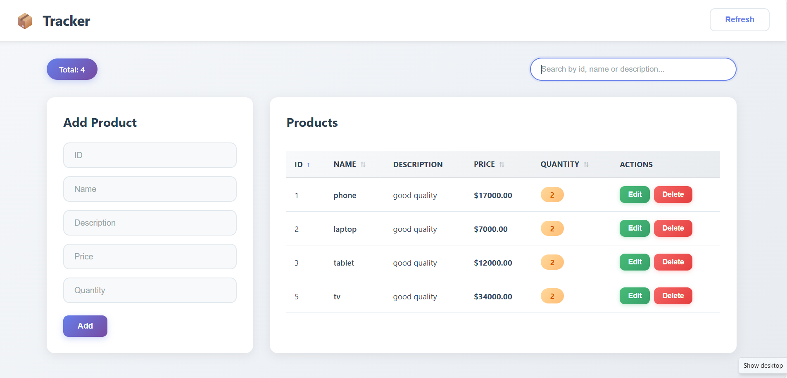

# 📦 Tracker - Product Inventory Management

A comprehensive full-stack product inventory management system built with FastAPI backend and React frontend, providing seamless tracking and management of product inventory with a beautiful, modern UI.



## ✨ Features

### Backend (FastAPI)
- **CRUD Operations**: Complete Create, Read, Update, Delete functionality
- **RESTful API**: Well-structured endpoints following REST principles
- **Database Integration**: SQLAlchemy ORM with SQLite database
- **CORS Support**: Configured for frontend integration
- **Auto Documentation**: Interactive API docs with Swagger UI

### Frontend (React)
- **Modern UI**: Clean, light-themed interface with smooth animations
- **Real-time Updates**: Instant reflection of changes
- **Search & Filter**: Quick product search by ID, name, or description
- **Sortable Columns**: Click column headers to sort data
- **Form Validation**: Client-side validation for all inputs
- **Responsive Design**: Works seamlessly on desktop, tablet, and mobile
- **Success/Error Messages**: User-friendly feedback for all operations

## 🚀 Quick Start

### Prerequisites
- Python 3.8+
- Node.js 14+
- npm or yarn

### Backend Setup

1. **Create and activate virtual environment:**
   ```bash
   python -m venv venv
   
   # Windows PowerShell
   venv\Scripts\activate.ps1
   
   # Windows CMD
   venv\Scripts\activate.bat
   
   # Mac/Linux
   source venv/bin/activate
   ```

2. **Install dependencies:**
   ```bash
   pip install fastapi uvicorn sqlalchemy
   ```

3. **Run the FastAPI server:**
   ```bash
   uvicorn main:app --reload
   ```

4. **Access the backend:**
   - API: http://localhost:8000
   - Interactive docs: http://localhost:8000/docs
   - ReDoc: http://localhost:8000/redoc

### Frontend Setup

1. **Navigate to frontend directory:**
   ```bash
   cd frontend
   ```

2. **Install dependencies:**
   ```bash
   npm install
   ```

3. **Run the React app:**
   ```bash
   npm start
   ```

4. **Access the application:**
   - Frontend: http://localhost:3000

## 📁 Project Structure

```
tracker/
├── backend/
│   ├── main.py              # FastAPI application with endpoints
│   ├── model.py             # Pydantic models for validation
│   ├── database.py          # Database configuration
│   ├── database_models.py   # SQLAlchemy ORM models
│   └── products.db          # SQLite database (auto-generated)
├── frontend/
│   ├── public/
│   ├── src/
│   │   ├── App.js           # Main React component
│   │   ├── App.css          # Styling with light theme
│   │   └── index.js         # React entry point
│   ├── package.json
│   └── package-lock.json
├── .gitignore
├── .gitattributes
├── image.png                # Application screenshot
└── README.md
```

## 🔌 API Endpoints

### Products

| Method | Endpoint | Description |
|--------|----------|-------------|
| GET | `/` | Welcome endpoint |
| GET | `/products/` | Get all products |
| GET | `/products/{id}` | Get a specific product by ID |
| POST | `/products/` | Create a new product |
| PUT | `/products/{id}` | Update an existing product |
| DELETE | `/products/{id}` | Delete a product |

## 📝 API Usage Examples

### Get all products
```bash
curl http://localhost:8000/products/
```

### Get product by ID
```bash
curl http://localhost:8000/products/1
```

### Create a new product
```bash
curl -X POST "http://localhost:8000/products/" \
     -H "Content-Type: application/json" \
     -d '{
       "id": 5,
       "name": "Monitor",
       "description": "4K Ultra HD monitor",
       "price": 299.99,
       "quantity": 15
     }'
```

### Update a product
```bash
curl -X PUT "http://localhost:8000/products/5" \
     -H "Content-Type: application/json" \
     -d '{
       "id": 5,
       "name": "Monitor",
       "description": "4K Ultra HD curved monitor",
       "price": 349.99,
       "quantity": 12
     }'
```

### Delete a product
```bash
curl -X DELETE "http://localhost:8000/products/5"
```

## 📊 Data Models

### Product Model
```python
{
  "id": int,           # Unique identifier
  "name": str,         # Product name
  "description": str,  # Product description
  "price": float,      # Product price (supports decimals)
  "quantity": int      # Available quantity
}
```

## 🛠️ Built With

### Backend
- [FastAPI](https://fastapi.tiangolo.com/) - Modern, fast web framework for building APIs
- [SQLAlchemy](https://www.sqlalchemy.org/) - SQL toolkit and ORM
- [Pydantic](https://pydantic-docs.helpmanual.io/) - Data validation using Python type hints
- [Uvicorn](https://www.uvicorn.org/) - ASGI server implementation

### Frontend
- [React](https://reactjs.org/) - JavaScript library for building user interfaces
- [Axios](https://axios-http.com/) - Promise-based HTTP client
- CSS3 - Custom styling with gradients and animations

## 🎨 UI Features

- **Light Theme**: Easy on the eyes with professional color scheme
- **Gradient Accents**: Purple gradients for primary actions
- **Smooth Animations**: Hover effects and transitions throughout
- **Responsive Tables**: Horizontal scroll on smaller screens
- **Sticky Header**: Navigation stays visible while scrolling
- **Auto-dismiss Messages**: Success/error messages fade after 5 seconds

## 🔧 Configuration

### CORS Settings
The backend is configured to accept requests from `http://localhost:3000`. To modify this, edit the `allow_origins` in `main.py`:

```python
app.add_middleware(
    CORSMiddleware,
    allow_origins=["http://localhost:3000"],
    allow_credentials=True,
    allow_methods=["*"],
    allow_headers=["*"],
)
```

### Database
The application uses SQLite by default. The database file (`products.db`) is created automatically on first run with sample data.

## 📄 License

This project is open source and available for educational purposes.

## 👥 Contributing

Contributions, issues, and feature requests are welcome!

## 🙏 Acknowledgments

- FastAPI documentation and community
- React documentation and community
- Modern UI/UX design principles
